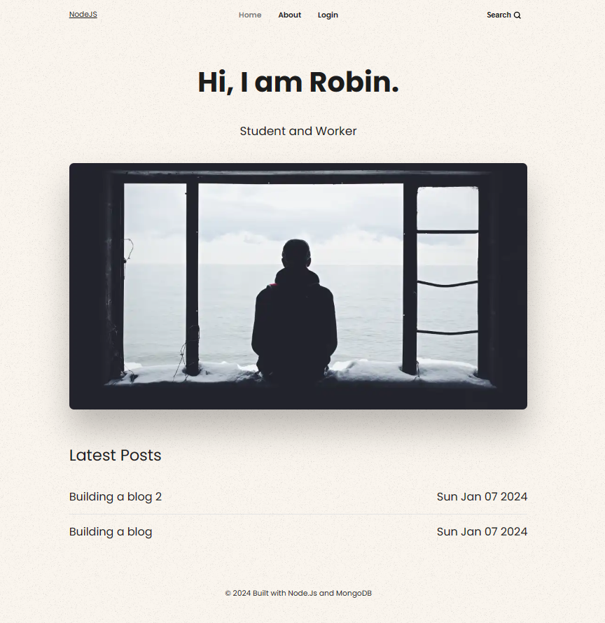

# Node.js, Express, EJS & MongoDB-Blog - CRUD

## Project Description
This project involves the creation of a small and simple online blog. The following technologies were used:

- **Frontend:** HTML, CSS
- **Backend:** Node.js Express Server and EJS (Embedded JavaScript)
- **Persistent Data Storage:** MongoDB

The blog was developed as part of a tutorial by Raddy.

A tutorial from [Raddy]([Raddy](https://github.com/RaddyTheBrand)): 
- Repository: [https://github.com/RaddyTheBrand/25.NodeJs-Express-EJS-MongoDB--Blog/tree/main](https://github.com/RaddyTheBrand/25.NodeJs-Express-EJS-MongoDB--Blog/tree/main)https://github.com/RaddyTheBrand/25.NodeJs-Express-EJS-MongoDB--Blog/tree/main
- YouTube Playlist: [https://www.youtube.com/watch?v=-foo92lFIto&amp;list=PL4cUxeGkcC9hAJ-ARcYq_z6lDZV7kT1xD&amp;index=1](https://www.youtube.com/watch?v=-foo92lFIto&amp;list=PL4cUxeGkcC9hAJ-ARcYq_z6lDZV7kT1xD&amp;index=1)

## You need:
- [Node.js](https://nodejs.org/en)
- Database [(MongoDB) Free Cluster](https://www.mongodb.com/de-de/cloud/atlas/register)
  - Create a new free cluster when you are logged in into [MongoDB Atlas](https://account.mongodb.com/account/login).
  - Click on *Connect* and choose *MongoDB for VS Code*.
  - You need the connection string that will be shown to you at this point:
    
  - Copy the connection string and store it in the .env-file which you have to create first (see next section). 

### Create .env file
Create a .env file to store your credentials. Example below:

`MONGODB_URI=mongodb+srv://<username>:<password>@clusterName.xxxxxxx.mongodb.net/blog`

`JWT_SECRET=MySecretBlog`
### Installation
To install and run this project - install dependencies using *npm install* and then start your server by *npm run dev*:

`$ npm install`

`$ npm run dev`

You can reach the application on port 5000: [http://localhost:5000/](http://localhost:5000/)
